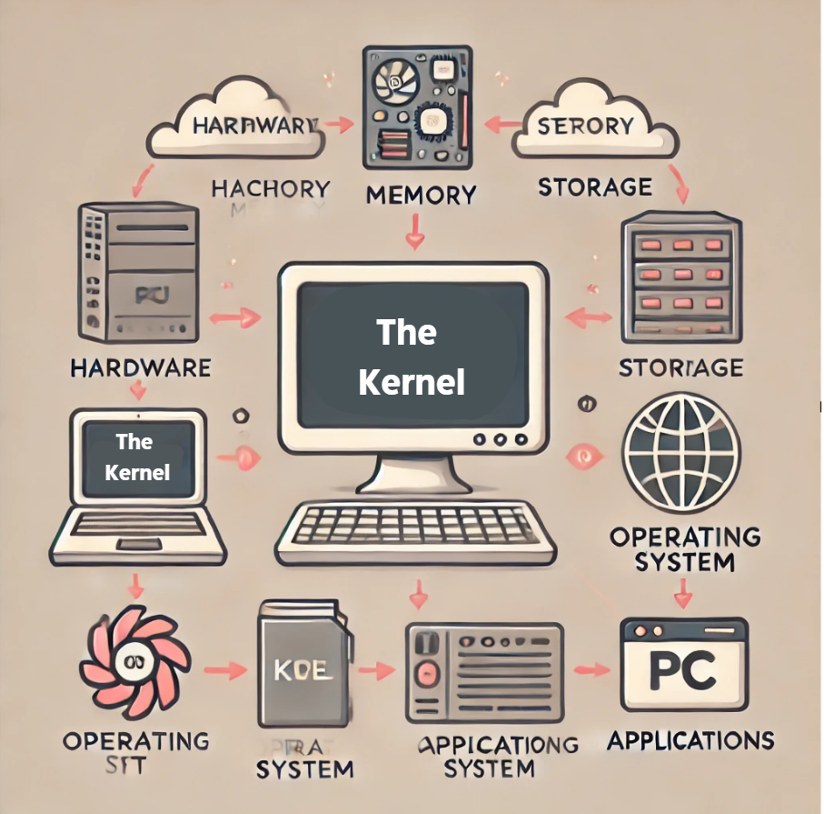
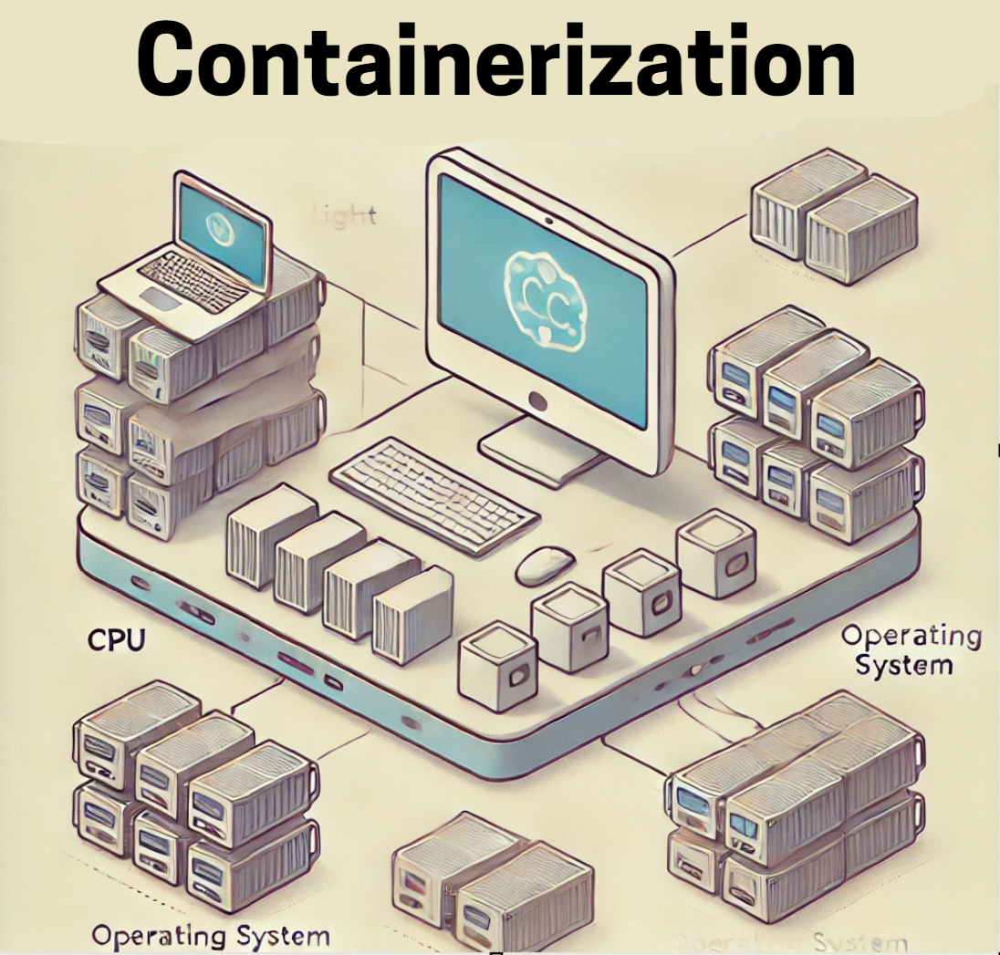
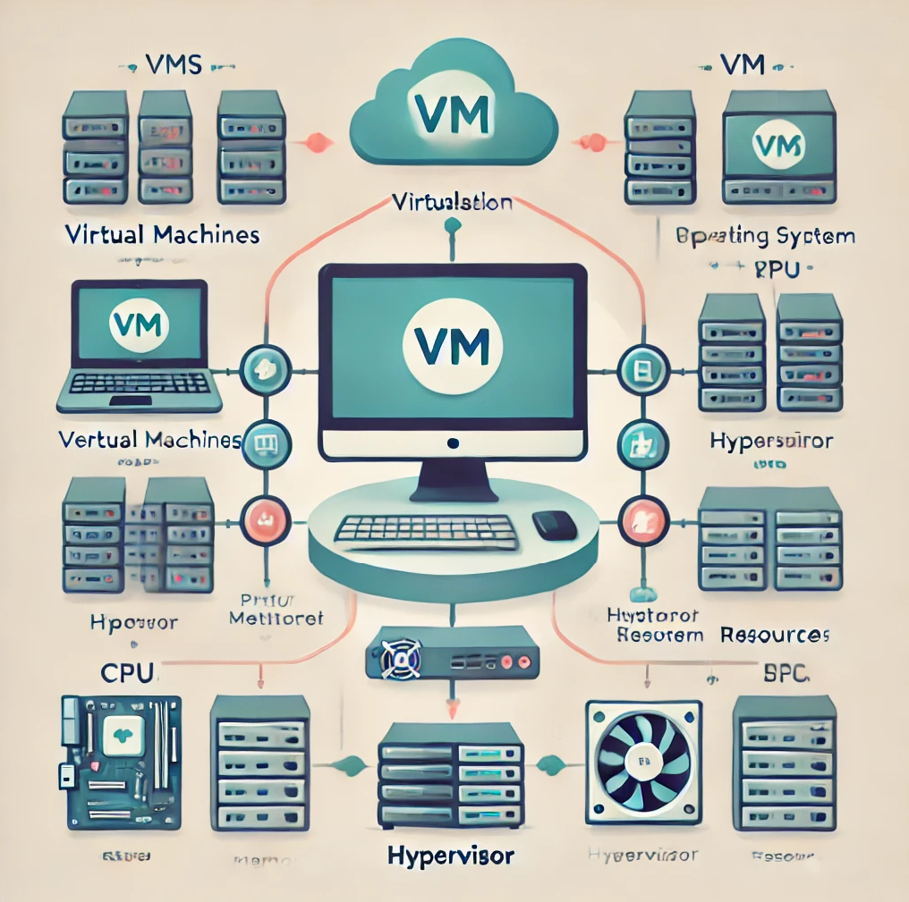
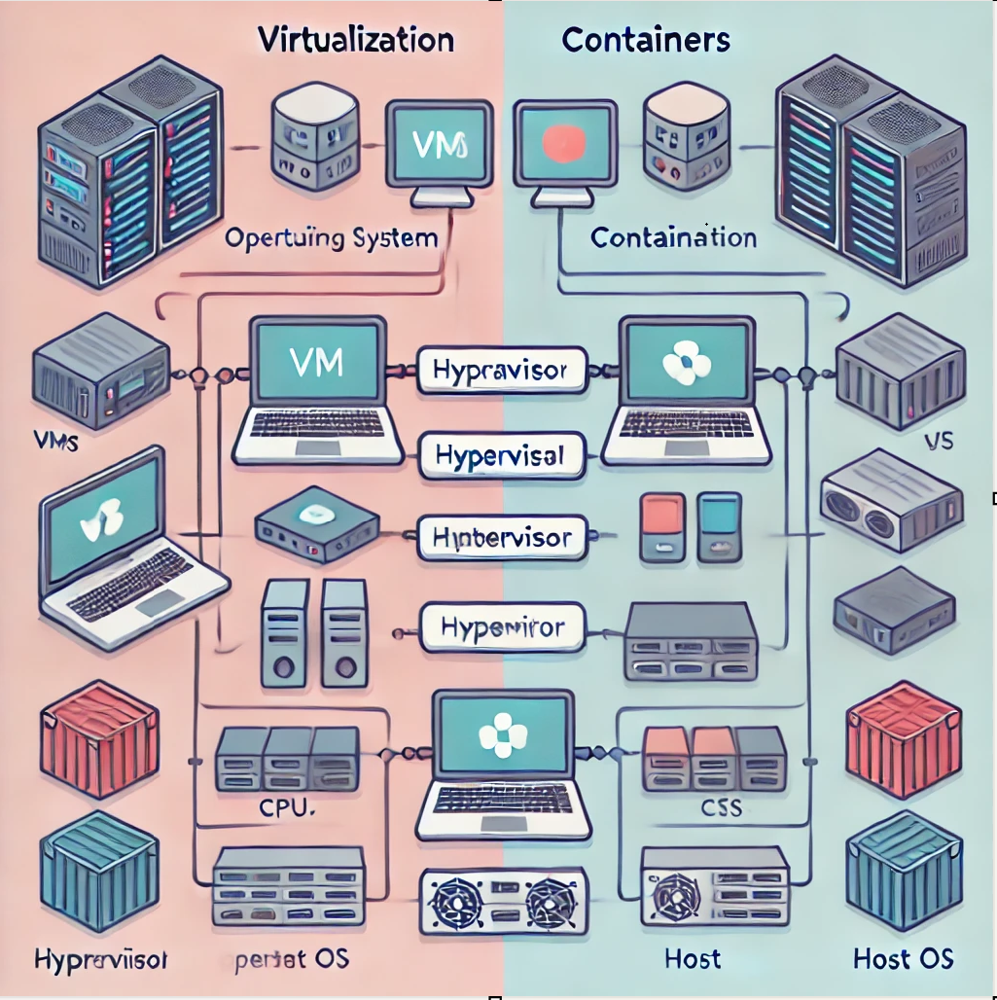
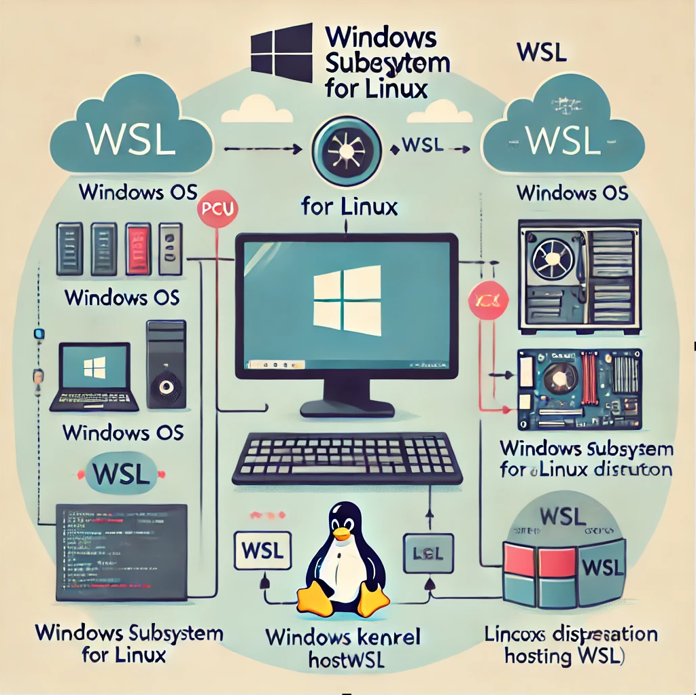
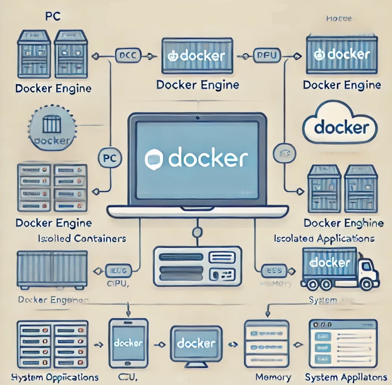

# Welcome to the student survival guide to cloud computing concepts :)
<h5>This is a guide for beginners to understand cloud computing. Below is the table of contents to the guide, and on the side are the different links</h5>

<h2>[Kernel](/is373hexo/2024/10/17/2-Kernel/)</h2> 
<h2>[Writing](/is373hexo/2024/10/17/2-Kernel/</h2>

 In the link following link we will cover Kernel definition, why Kernel, how it works, and it's importance:
 

<h2>2. Containerization</h2>

 In the link following link we will cover Containerization definition, why containerization, how it works, and it's importance:
 

<h2>3. Virtualization</h2> 

 In the link following link we will cover Virtualization definition, why virtualization, how it works, and it's importance:
 

<h2>4. VMs vs Baremetal</h2> 

 In the link following link we will cover VMs vs Baremetal definition, and the differences between the two:
 

<h2>5. Containerization vs. Virtualization</h2>

 In the link following link we will cover the difference between Containerization and Virtualization definition, strengths, and limitations:
 

<h2>6. WSL (Windows Subsystem for Linux)</h2>

 In the link following link we will cover WSL definition, why WSL, how it works, it's importance, installation process:
 

<h2>7. Kubernetes vs Docker</h2>

 In the link following link we will cover the  differences between Kubernetes vs Docker, and why you would pick one over the other.
 

<h2>8. Docker</h2> 

 In the link following link we will cover Docker definition, why Docker, how it works, it's importance, installation process:
 
