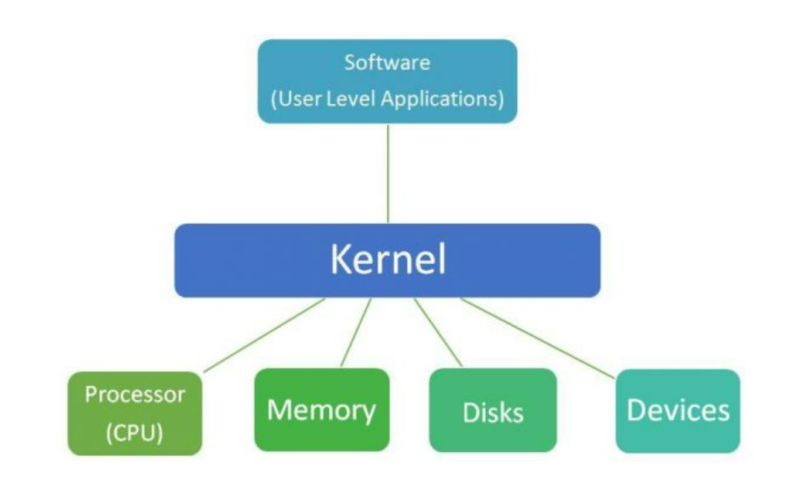

## Definition
The Kernel is the core part of the operating system that manages system resources and allows communication between software and hardware.

## Why Kernel?
The Kernel is responsible for many important tasks such as allocating and managing the system's memory. It manages the device by handling the communication between the system and hardware devices. It manages the file system by managing data storage and retreival from file systems. Lastly, it manages all the processes and thread: including theier creation, execution and termination. 

## Importance
Without the Kernel, a system would be chaotic, insecure and insufficient. The Kernel provides is the central control allowing the entire system to function properly and it brings system effficiency by not allowing the system to become unresponsive or slow down. Also, the kernel provides security by ensuring overall stability/protecting the system from any unauthorized access and the kernel simplifies hardware interaction which enables compatibility where that brings ease of use for any developer.  

## How it Works
Manages Hardware: The kernel translates requests from applications into actions that the hardware can understand by becoming a bride between hardware and applications.
Handle Processes: The kernel controls the execution of processes, processes the isolation between it and ensures CPU usage.
Controls Memory: The kernel manages how memory is allocated, used, and swapped between applications to ensure smooth operation.
Facilitates Communication: Through system calls and APIs, it allows user applications to request resources and interact with the system.
Maintains Security: The kernel enforces system security through access control, process isolation, and user authentication.
