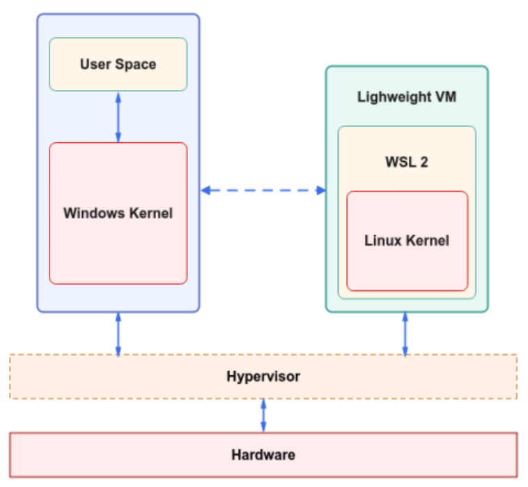

<h1>Definition</h1>
WSL is a tool that lets you run a full Linux environment directly on your Windows computer. It’s like having both Windows and Linux side-by-side without needing to switch between them. You can use Linux commands, run Linux software, and work with files in both systems easily. Think of WSL as a bridge that allows Windows to use Linux features without needing a separate Linux installation.

<h1>How does WSL work?</h1>
WSL creates a lightweight "virtual machine" inside your Windows system. It lets Windows and Linux work together smoothly by:

1. Running Linux software: You can use Linux commands, tools, and even programming environments just as you would on a real Linux machine.
2. Sharing files: You can access your Windows files from within the Linux environment and vice versa. This means you can work with the same files on both systems seamlessly.
3. Integrated terminal: WSL comes with a terminal (a command-line interface) that feels like Linux but runs inside Windows.

<h1>Why is WSL important?</h1>
WSL is a big deal for several reasons:

1. Easy access to Linux commands: You don’t need to install a separate Linux machine or deal with complicated setups to access Linux commands and software.
2. Lightweight: It doesn’t require much memory or storage compared to running a full virtual machine. It’s fast and efficient.

<h1>Installation Process:</h1>
<h1>Installing WSL on Windows</h1>

1. Enable WSL:
Open PowerShell (search for it in the start menu, right-click, and run as administrator).
Type this command and press Enter: wsl --install. This installs WSL and sets up a Linux distribution (usually Ubuntu by default).

2. Restart your computer: Once the installation finishes, restart your computer.

3. Choose a Linux distribution:
After restarting, WSL will ask you to choose a Linux distribution (like Ubuntu, Debian, etc.).
Pick one that works best for you (Ubuntu is a popular choice).

4. Set up your Linux environment:
Once the installation is complete, open the Linux terminal by searching for "Ubuntu" (or the Linux distro you chose).
You’ll be asked to create a username and password for your Linux environment.

5. Start using Linux commands: You’re now ready to use Linux on Windows! Open the terminal and start running Linux commands.

<h1>For Mac Users:</h1>
Mac doesn’t support WSL because it’s a Windows feature. However, Mac already comes with a Unix-based system, which is quite similar to Linux. So, you don't need WSL on a Mac. Instead, you can directly use the Terminal app on your Mac to run Unix-like commands.

But, if you specifically want to run a Linux environment on a Mac, here are some options:
1. Use Homebrew: This is a package manager for macOS, which can help you install Linux-like tools and packages.
2. Use a virtual machine: You can install software like VirtualBox or VMware to run a full Linux distribution in a virtual machine on your Mac.
