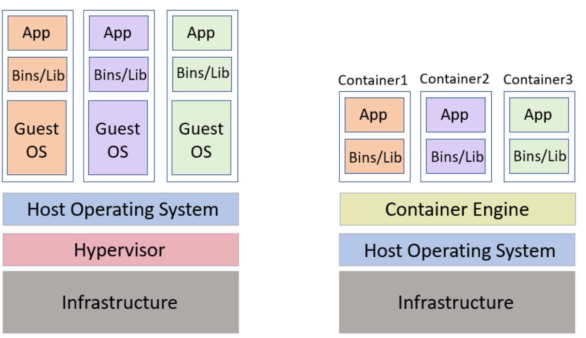

<h1> Containerization vs Virtualization </h1>

As we could learn from previous readings:

_Virtualization_ helps us to create virtual versions of a computer resource such as devices, storage, networks, servers, or even applications. 
It allows organizations to partition a single physical computer or server into several virtual machines (VM). 
Each VM can then interact independently and run different operating systems or applications while sharing the resources of a single computer.

Some advantages of Virtualization are: 
1. Enhanced performance
2. Promotes use of resources in optimum manner
3. Space saving

and Containerization: 

_Containerization_ is a lightweight alternative to virtualization. This involves encapsulating an application in a container with its own operating environment.
Thus, instead of installing an OS for each virtual machine, containers use the host OS. Since they don't use a hypervisor, you can enjoy faster resource provisioning.

Some advantages of Containerization are:
1. Containers share the machine’s operating system Kernel. They do not require to associate the operating system from within the application hence they are lightweight.
2. It takes less start-up time in the environment where it is deployed.
3. It’s ideal for automation and DevOps pipelines, including continuous integration and continuous deployment (CI/CD) implementation.

Some of the differences between containerization and virtualization are: 

