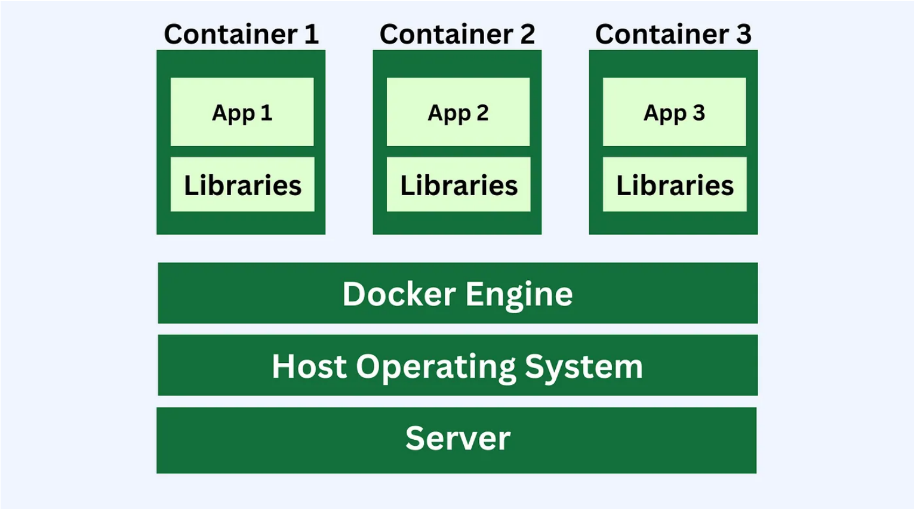

# Containerization

## Definition
Containerization is a method of packaging software into a single "container." 
This container can run consistently on any computing environment, whether it's a developer's laptop, 
a server, or a cloud platform.

## Why Containerization?
Containerization eliminates issues where software works on one machine but not another
because of differences in environments. Containerization bundles the software and all 
its dependencies into a portable container.

## Importance
Containers provide a consistent environment for software applications, 
making it easier to develop, test, and deploy across different platforms.

## How it Works
Containers enable the creation of isolated environments for each application by utilizing the system’s operating system (OS). Unlike virtual machines (VMs), which require a full OS for each instance, containers share the host’s OS, making them lightweight and faster to start. This form of virtualization allows multiple applications to run in isolated "containers" on the same computer. Since containers share the host's OS (e.g., Windows, macOS, or Linux), they use less storage and memory, offering fast startup times while maintaining application isolation.

<h3>Next Page</h3>
https://github.com/tomasGonz67/is373/blob/dev/Virtualization.md
