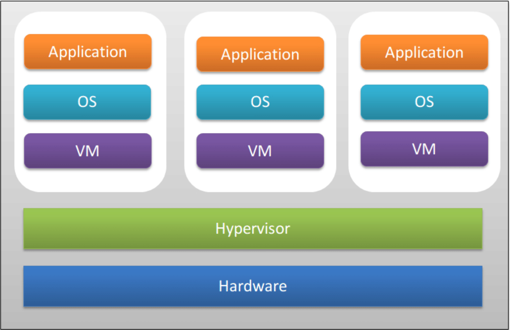

<h1>Virtualization</h1>
<h1>Definition</h1>
Virtualization is the process of creating virtual instances of physical hardware such as servers, storage devices, or network resources. 

<h1>Why Virtualization?</h1>
Virtualization allows for one physical machine to fully maximize its resources by creating numerous virtual machines. This allows for horizontal scaling by spinning up more VMs across multiple servers to handle increasing demand.

<h1>Importance</h1>
Virtualization provides flexibility and efficiency in managing IT resources. This allows businesses to save money by reducing hardware costs and getting the most value out of it's resources.

<h1>How it Works</h1>
Virtualization works by using a hypervisor, which is software that sits between the physical hardware and the virtual machines (VMs). A VM operates like an independent computer with its own OS and applications, separate from the host's OS. Unlike containers, VMs require a full OS for each instance, which makes them more resource-intensive. This setup provides strong isolation between environments, allowing multiple operating systems to run on the same physical machine. However, because each VM runs a complete OS, VMs are heavier (using more storage and memory) and slower to start compared to containers.

<h3>Next Page</h3>
https://github.com/tomasGonz67/is373/blob/dev/Containerization%20vs%20Virtualization.md
