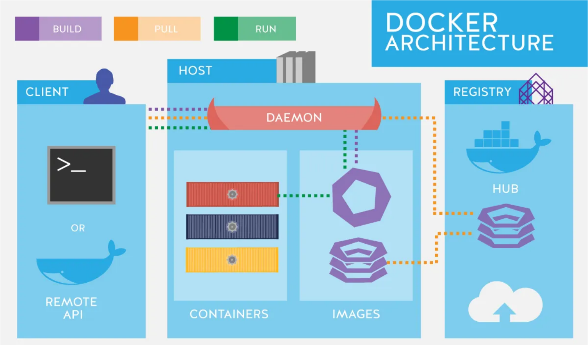

<h1>Introduction to Docker</h1>
Docker is an open source tool that helps developers build, run, and package an application (and all the things it needs like libraries, code, and settings) using software packages known as "containers." Docker can allow developers to ship code quickly, standardize application operations, improve resource utilization, simplify workloads, and stay ahead of security issues.

<h1>Installing Docker</h1>
<h2>Windows</h2>
1.) Download Docker Desktop from official website: https://www.docker.com/  
2.) Run the Installer: Open downloaded exe file and follow insallation process.  
3.) Enable WSL 2: Use the commands "wsl --install" and "wsl --set-default-version 2" in terminal  
4.) Launch Docker.

<h2>Mac</h2>
1.) Download Docker Desktop from official website: https://www.docker.com/  
2.) Run the installer: Open .dmg file that was downloaded and drag icon into applications folder.  
3.) Launch Docker.  
